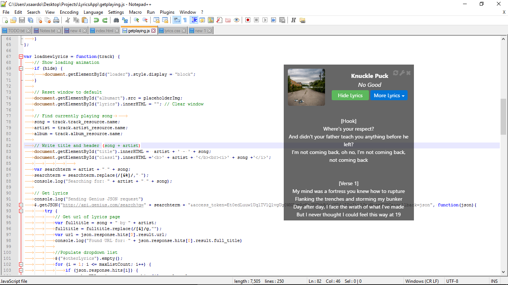

Always-on-top lyrics for Spotify's desktop player
* Fetches lyrics for the currently playing song in the desktop player
* Automatically updates the lyrics upon track changes
* User can select from additional lyrics options if the automatic option is incorrect
* Features to implement: options window
* Example usage
* 
